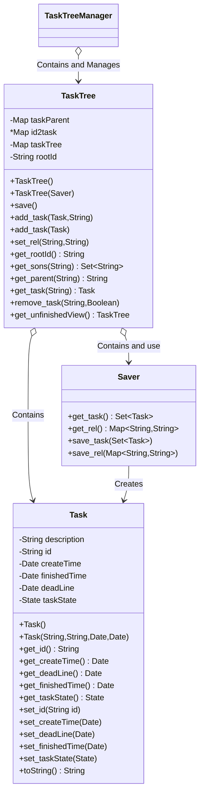

```mermaid
classDiagram
class Task{
    -String description
    -String id
    -Date createTime
    -Date finishedTime
    -Date deadLine
    -State taskState
    +Task()
    +Task(String,String,Date,Date)
    +get_id() String
    +get_createTime() Date
    +get_deadLine() Date
    +get_finishedTime() Date
    +get_taskState() State
    +set_id(String id)
    +set_createTime(Date)
    +set_deadLine(Date)
    +set_finishedTime(Date)
    +set_taskState(State)
    +toString() String

}

class TaskTree{
    -Map taskParent
    *Map id2task
    -Map taskTree
    -String rootId

    +TaskTree()
    +TaskTree(Saver)

    +save()

    +add_task(Task,String)
    +add_task(Task)

    +set_rel(String,String)

    +get_rootId() String
    +get_sons(String) Set~String~
    +get_parent(String) String
    +get_task(String) Task
    +remove_task(String,Boolean)

    +get_unfinishedView() TaskTree
}

class Saver{
    +get_task() Set~Task~
    +get_rel() Map~String,String~
    +save_task(Set~Task~)
    +save_rel(Map~String,String~)
}

class TaskTreeManager

TaskTree o--> Task : Contains
TaskTree o--> Saver : Contains and use
Saver --> Task : Creates
TaskTreeManager o--> TaskTree : Contains and Manages
```